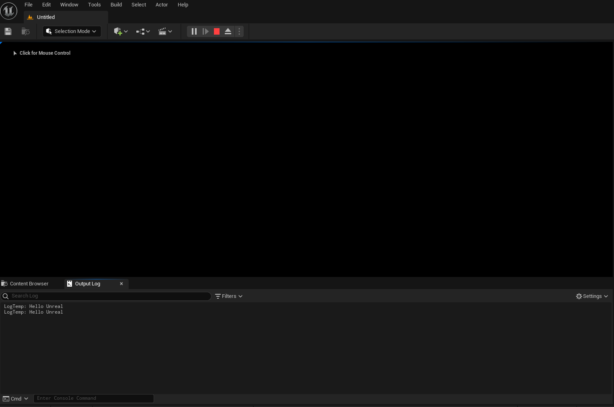

# 언리얼 C++ 기본 타입과 문자열

## 언리얼 C++ 기본 타입

### 왜 언리얼은 기본 타입을 따로 지정하는가?
- 1970년대에 개발되서 아직도 사용 중인 C++ 언어
  - 시대에 따라 발전한 하드웨어 사양
  - 플랫폼 파편화 (Platform Fragmentation)

- C++ 최신 규약에서 int는 최소 32비트를 보장하도록 규정되어 있음
  - 특정 플랫폼에서는 64bit로 해석될 수 있음
  - 따라서 데이터를 저장할 때 int 타입의 크기를 확신할 수 없음

- 게임 제작의 특징
  - 데이터 정보가 명확해야 한다.
  - 단일 컴퓨터에서 최대 퍼포먼스를 뽑아내야 한다.
  - 네트웍 상에서 데이터 통신이 효율적이고 안정적이어야 한다.

```
데이터 타입의 애매 모호함은 게임 개발 시 문제를 일으킬 수 있음.
```

### int 타입과 크기
- 후발 언어 C#의 경우 int 타입이 있지만 4바이트인 int32로 명확히 정의되어 있음
- 언리얼은 int를 사용하지 않고 자체적으로 지정한 int32를 사용함


### 언리얼 엔진의 타입과 크기
- 언리얼 엔진에서 사용하는 기본 타입 (코딩 표준 문서 참고)


### bool 타입의 선언
- 데이터 전송을 고려한 참/거짓 데이터의 지정
- bool은 크기가 명확하지 않음
- 헤더에는 가급적 bool 대신 uint8 타입을 사용하되 Bit Field 오퍼레이터를 사용
- 일반 uint8과의 구분을 위해 b접두사를 사용.
- Cpp 로직에서는 자유롭게 bool을 사용

## 캐릭터 인코딩

### 왜 언리얼은 문자열을 따로 지정하는가?
- 1990년대 후반에 이르러서야 표준화된 아시안 문자열 표준화된 아시안 문자열 표준 (한국, 중국, 일본) / 새로운 규약이 필요
- 하지만 컴퓨터는 그전에도 사용했었다 (영어권)
- 문자열 처리의 종류
  - Single byte(ANSI, ASCII) : 컴퓨터 초창기
  - Multibyte(EUC-KR, CP949) : 컴퓨터 보급기 (1990년대 초중반)
  - Unicode(UTF-8, UTF-16) : 국제 표준 정착기 (1990년대 후반)
- 하지만 이 모든 문자열은 아직도 사용되고 있음
  - C++ STL은 ASCII, UTF-8, UTF-16만 지원함
  - Windows10은 멀티바이트를 지원함. 하지만 다른 운영체제는 지원하지 않음.

## 언리얼 캐릭터 인코딩

- https://docs.unrealengine.com/5.3/ko/character-encoding-in-unreal-engine/


### UE 내부 스트링 표현
- 언리얼 엔진의 모든 스트링은 FStrings 혹은 TCHAR 정렬 상태로 UTF-16 포맷 메모리에 저장됩니다.

- 소스코드에서 한글을 작성하고 싶을 때는 UTF-8 방식으로 사용할 수 있으나 여러가지 문제 발생 위험성이 있기 때문에 사전에 감안하여 잘 처리하여야 한다.

## TCHAR와 FString

- GameInstance 클래스를 상속 받은 MyGameInstance 생성


- 가장 먼저 public과 private을 선언한다.


- cpp 파일에서 작업을 시작할 때 Super(부모 클래스 선언)를 선언해줘야 한다.


- 문자열은 기본적으로 T 캐릭터의 배열


- 문자열을 다양하게 조작하고 싶다면 언리얼 엔진에서 제공하고 있는 FString 캐릭터를 사용해야 한다.

- 단, FString을 그대로 쓰면, TCHAR 포인터가 반환이 되지 않는다.
- 포인터 연산자를 통해 지정을 해줘야 한다.
- (헤더를 수정하지 않으면 언리얼 내 라이브 코딩 (Ctrl + Alt + F11) 을 통해 빌드가 가능하다)




### 복잡한 문자열 처리를 하나로
- 유니코드를 사용해 문자열 처리를 통일
  - 이 중에서 2byte로 사이즈가 균일한 UTF-16을 사용
  - 유니코드를 위한 언리얼 표준 캐릭터 타입: TCHAR

- 문자열은 언제나 TEXT 매크로를 사용해 지정.
  - TEXT 매크로로 감싼 문자열은 TCHAR 배열로 지정됨

- 문자열을 다루는 클래스로 FString를 제공함
  - FString은 TCHAR 배열을 포함하는 헬퍼 클래스

- https://docs.unrealengine.com/5.3/ko/fstring-in-unreal-engine/

```C++
FString TestHUDString = FString(TEXT("This is my test FString."));
```

- 숫자 및 기타 변수


- Printf 또한 FString에서 제공 된다.

### FString의 구조와 활용


```
FString의 경우에는 선언을 하게 되면 TCHAR 배열로 만들어지게 되는데 이것을 FString으로 집어 넣는 순간 TArray라고 하는 언리얼 엔진이 제공하는 동적 배열 클래스로 문자열이 보관이 된다.

이 동적 배열에서 우리가 실제 데이터를 꺼냈을 때 동적 배열이 속하고 있는 내부 자료에 대한 포인터를 가져온다 (Dereferencing 역참조)

포인터 연산자를 앞에 써주면 FString이 포험하고 있는 동적 배열 TArray에 또 TArray가 포함하고 있는 첫 번째 인자의 포인터를 반환을 해준다.

FString을 중심으로 TCHAR 데이터를 관리하되 TCHAR 형태로 데이터가 필요한 경우에는 포인터 연산자를 제공해주면 무리 없이 사용할 수 있다.

FString 자체적으로 다양한 기능을 제공하기 때문에 안에 데이터들을 여러 가지로 자르거나 붙이거나 새로운 방식으로 불러들이는 등 다양한 연산을 할 수 있다.

FString이 제공하는 함수들은 내부적으로 FCString이라는 클래스가 있다. 이 FCString 클래스는 C 라이브러리에서 제공하는 기본적인 스트링 관련 함수들을 포함하고 있는 레퍼런스 클래스라고 생각하면 된다.

FString이 데이터를 보관하지만 실제 연산은 FCString을 통해 이루어 진다.
```

#### 유용한 함수

- 다른 타입에서 FString으로의 변환
  - FString::Printf
  - FString::SanitizeFloat
  - Fstring::FromInt

- C런타임 수준에서 문자열을 처리하는 클래스 FCString
  - 예) 문자열을 찾는 strstr을 사용
  
- FString에서 다른 타입으로의 변환 (안전하진 않으므로 주의)
  - FCString::Atoi
  - FCString::Atof

### FString 예제

- 다양한 함수


- 한글이 기본적으로 CP949 형태에 멀티 바이트 스트링으로 저장이 돼서 UTF-16과 호환이 안되어 ¿ 가 뜨게 되었다

- 이 경우에는 Save as -> Save with Encoding 을 통해 UTF-8 형태로 저장


## FName의 활용

### 언리얼이 제공하는 다양한 문자열 처리
- FName: 에셋 관리를 위해 사용되는 문자열 체계 (문자열을 사용하지만 해시값을 사용하는 key value 쌍으로 이루어져 있음)
  - 대소문자 구분 없음
  - 한번 선언되면 바꿀 수 없음
  - 가볍고 빠름
  - 문자를 표현하는 용도가 아닌 에셋 키를 지정하는 용도로 사용
  - 빌드 시 해시값으로 변환됨
  - https://docs.unrealengine.com/5.3/ko/fname-in-unreal-engine/

- FText: 다국어 지원을 위한 문자열 관리 체계
  - 일종의 키로 작용함
  - 별도의 문자열 테이블 정보가 추가로 요구됨
  - 게임 빌드 시 자동으로 다양한 국가별 언어로 변환됨


### FName의 구조와 활용
- 언리얼은 FName과 관련된 글로벌 Pool 자료구조를 가지고 있음
- FName과 글로벌 Pool
  - 문자열이 들어오면 해시값을 추출해 키를 생성해 FName에서 보관
  - Fname 값에 저장된 값을 사용해 전역 Pool에서 원하는 자료를 검색해 반환
  - 문자 정보는 대소문자를 구분하지 않고 저장함. (Ignore Case)

- FName의 형성
  - 생성자에 문자열 정보를 넣으면 풀을 조사해 적당한 키로 변환하는 작업이 수반됨
  - Find or Add


### FName 예제


- 대소문자 구분이 없다

### FName 주의사항


## 정리

### 언리얼 C++ 기본 타입과 문자열 처리
1. 언리얼이 C++ 타입 int를 사용하지 않는 이유
2. 다양한 캐릭터 인코딩 시스템의 이해
3. 언리얼의 문자열 처리의 이해
4. FString의 구조와 사용 방법
5. FName의 구조와 사용 방법