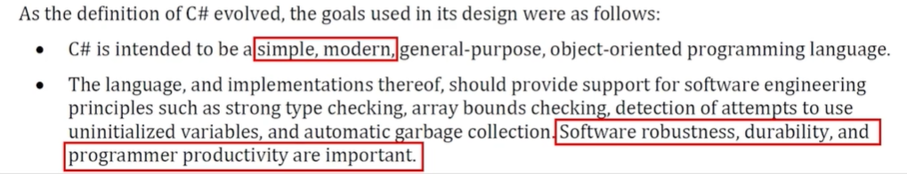
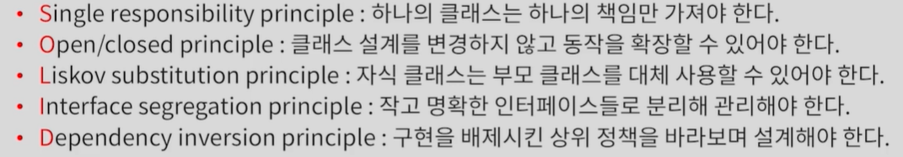

# 언리얼 오브젝트 소개

### 게임 프로그래밍의 특수성
- 사용자 : 쾌적한 경험을 위해 단일 컴퓨터에서 최대 성능을 뽑아 내야 한다.
- 개발자 : 게임의 규모가 커질수록 방대하고 복잡한 기능을 안정적으로 관리 해야 한다.


### C++ 언어의 단점
- 1970년대에 개발된 C++ 언어
  - 객체 지향 프로그래밍의 선두 주자
  - 지속적으로 개선해왔지만, 익혀야 할 내용이 많아 초급자가 학습하기 어려움
  - 하드웨어에 직접 접근하기 때문에, 잘못 사용하면 프로그램에 큰 영향을 미침

- 1990년 중반 이후 C++의 단점을 보완한 후발 언어의 등장 (Java, C#)
  - C++의 불필요한 기능을 걷어내고, 최대한 명확하고, 간결하게 설계
  - 성능보다 안정성과 생산성을 중요시
  - 하드웨어에 직접 접근하지 않고, 가상 머신을 통해 간접적으로 접근
  


### 모던 객체 지행 설계 원칙
- 디자인 패턴을 필두로 안정적인 설계 방법이 연구됨
- 현재 시점에서 모던(Modern) 하다는 뜻은 아님
- 유지 보수와 유연함, 확장성 향상을 위한 객체 지향 프로그래밍 원칙 (SOLID)



- 후발 언어 (C#, JAVA) 등이 보완한 새로운 기능


```
게임 규모가 대형화되면서 모던 객체 지향 설계 도입이 필요해짐
```

### 언리얼 엔진의 선택
- 성능을 위해 기존 C++ 언어를 포기할 수 없음.
- 기존 C++ 언어를 확장해 모던 객체 지향 설계를 가능하도록 만듬.
- 모던 객체 지향 설계를 위한 새로운 시스템을 구축


### 언리얼 오브젝트
- 언리얼 엔진이 설계한 새로운 시스템의 단위 오브젝트(객체)
  - 기존 C++ 오브젝트에 모던 객체 지향 설계를 위한 다양한 기능의 추가한 오브젝트
  - 일반 C++ 오브젝트와 언리얼 오브젝트의 두 객체를 모두 사용할 수 있음
  - 구분을 위해 일반 C++ 오브젝트는 F, 언리얼 오브젝트는 접두사 U를 사용함.

- 각 오브젝트의 사용 용도
  - C++ 오브젝트: 저수준의 빠른 처리를 위한 기능 구현에 사용
  - 언리얼 오브젝트 : 콘텐츠 제작에 관련된 복잡한 설계 구현에 사용


- https://docs.unrealengine.com/5.3/ko/objects-in-unreal-engine/

### 언리얼 오브젝트가 가지는 특징
- 클래스 기본 객체 (CDO) : 클래스의 기본 값과 타입 정보의 제공
- 리플렉션 (Reflection) : 런타임에서 클래스 정보의 참조 기능
- 인터페이스(Interface) : 모던 객체 지향 언어가 제공하는 인터페이스의 제공
- 향상된 열거형 : 보다 향상된 열거형의 지원
- 델리게이트(Deligate) : 객체간의 결합을 낮출 수 있는 델리게이트 기능의 제공
- 가비지컬렉션(Garbage Collection) : 자동 메모리 관리
- 향상된 구조체 (Struct) : 리플렉션이 가능한 구조체의 지원
- 직렬화(Serialization) : 객체 정보를 바이트 스트림으로 저장, 전송, 불러들이는 기능

## 언리얼 오브젝트의 선언


- UCLASS() : 언리얼 오브젝트 선언임을 명시하기 위한 매크로
- 프로젝트명_API : 다른 모듈에서도 이 Object를 사용할 수 있게 개방해준다는 의미
- 키워드를 삭제할 경우 프로젝트 모듈 내에서만 오브젝트를 사용할 수 있다
- GENERATED_BODY() : BODY_MACRO_COMINE, CURRENT_FILE_ID, LINE, GENERATED_BODY 4가지 정보를 묶어서 하나의 긴 문자를 만든다


- 결론적으로 GENERATED_BODY() 는 Generated.h 에 있는 헤더 파일을 사용한다
- 오브젝트 헤더 파일을 수정 후 빌드를 할 경우 Generated.h 코드들이 자동으로 수정이 된다
- parsing headers for Unreal Object Editor : InternalUnrealHeaderTool (UHT) 라는 언리얼 헤더 툴을 사용한다
- 언리얼 오브젝트의 코드를 분석하는 것은 언리얼 헤더 툴에 의해서 소스 코드를 자동으로 생성하고 자동으로 생성된 코드를 포함해서 마지막 최종 빌드를 진행하는 두 단계의 과정으로 진행된다.

## 정리

### 언리얼 오브젝트의 이해
- 게임이 대형화되면서 성능과 유지보수 두 가지가 모두 중요해짐.
- 언리얼 엔진은 C++ 언어를 확장한 언리얼 오브젝트라는 객체 구조를 고안함
- 지정된 매크로를 사용해 빌드를 수행하면 추가 코드가 자동으로 만들어지는 구조를 가짐
- 언리얼 오브젝트를 사용해 대규모 게임 제작을 안정적으로 설계하고 구현할 수 있음